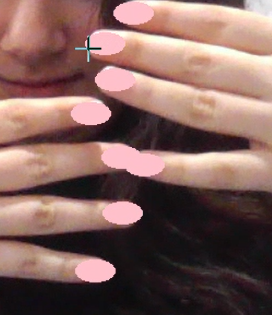
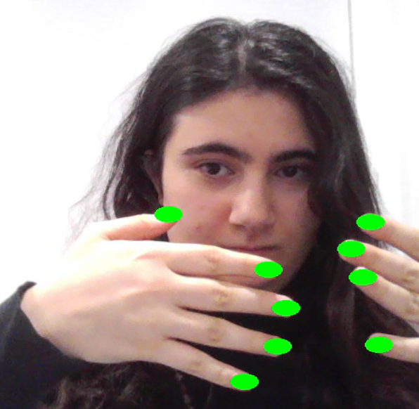
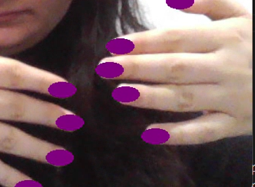

# Nail Style Visualizer

## See what different polish colours look like on your nails!

[Back to Top](#nail-style-visualizer)

## Change style using voice commands!

No need to lower your hands and type lengthy commands or scroll through different combinations to try on nails! Simply press one button and tell it what you want to see!

Press 'c' to say what colour you want (with the whole rainbow available!).

[Back to Top](#nail-style-visualizer)

## Best of all, it's free!

Try on nails for free before paying $$$ to get them done professionally or invest in a new colour of nail polish.

## Credits/Contact

This humorous little project is dedicated to my ECE241 lab partner, who gave me the inspiration for this project.

However, this project was designed and implemented by Sophia Alexanian (me!). I wanted to practice using voice recognition and computer vision libraries in Python.   
I can be reached here:  
LinkedIn: https://www.linkedin.com/in/sophia-alexanian/   
Email: sophia.alexanian@mail.utoronto.ca

[Back to Top](#nail-style-visualizer)

